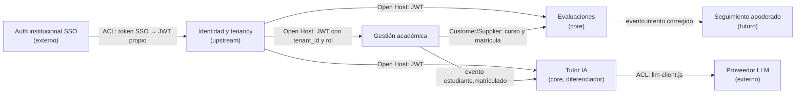

# Bounded contexts y context map — AulaViva (S06)

> Fronteras del dominio del monolito modular (ADR 0002). Cada contexto es un módulo del backend (`code/backend/src/modules/<contexto>`) con sus propias tablas; otro módulo no escribe en ellas. DER en [der.png](der.png) (contexto principal) y [der-completo.png](der-completo.png).

## Lenguaje ubicuo: "Estudiante" significa algo distinto en cada contexto

| Contexto | Qué es un "Estudiante" aquí | Qué le importa |
|---|---|---|
| Identidad y tenancy | Un `usuario` con rol `estudiante` en un colegio, con email y credenciales | Quién es, de qué colegio, si está activo |
| Gestión académica | Alguien **matriculado** en un curso | A qué cursos pertenece |
| Evaluaciones | Quien **rinde** un intento | Sus respuestas y su puntaje |
| Tutor IA | Quien **consulta** al tutor dentro de un curso | Sus preguntas y el contexto (apuntes) del curso |

## Contextos

| Contexto | Responsabilidad | Agregados (raíz) | Tablas | Historias |
|---|---|---|---|---|
| **Identidad y tenancy** | Colegios (tenants), usuarios, roles, login en dos pasos (RBD → email); aislamiento por `colegio_id` | Colegio, Usuario | `colegios`, `usuarios` | base de todas |
| **Gestión académica** | Cursos por periodo y matrícula de estudiantes | Curso (incluye matrículas) | `cursos`, `matriculas` | H1 |
| **Evaluaciones** | Crear, publicar y rendir evaluaciones; corrección automática y resultados | Evaluación (preguntas + alternativas), Intento (respuestas) | `evaluaciones`, `preguntas`, `alternativas` (+ vista `alternativas_publicas`), `intentos_evaluacion`, `respuestas_estudiante` | H2, H3, H4 |
| **Tutor IA** | Apuntes del curso, embeddings (RAG) y consultas asíncronas al LLM | Apunte (embeddings), Consulta (fuentes) | `apuntes_curso`, `apuntes_embeddings`, `consultas_tutor_ia`, `consultas_fuentes` | H5 |
| *Plataforma (soporte, no es dominio)* | Outbox de eventos, idempotencia, trazas | — | `outbox_eventos`, `claves_idempotencia` | transversal |

Fuera del MVP (backlog "Won't have"): **Seguimiento del apoderado**. Será un contexto consumidor de `intento.corregido`, sin escribir en Evaluaciones.

## Context map

| Relación | Tipo | Cómo se implementa |
|---|---|---|
| SSO → Identidad | Anticorruption Layer | El login traduce el token del SSO a un JWT propio con `tenant_id` y `rol`. |
| Identidad → resto | Open Host Service | Todos los contextos confían en el JWT y en `SET LOCAL app.colegio_id` (RLS fail-closed). |
| Gestión académica → Evaluaciones | Customer / Supplier | Evaluaciones usa el curso y la matrícula para validar quién puede rendir (FK a `matriculas`); no los modifica. |
| Gestión académica → Tutor IA | Eventos | `estudiante.matriculado` habilita al estudiante en el tutor del curso. |
| Tutor IA → LLM | Anticorruption Layer | `modules/tutor/llm-client.js` es la única pieza que conoce al proveedor (hoy Ollama en desarrollo). |
| Evaluaciones → Apoderado (futuro) | Eventos | Consumirá `intento.corregido`. |

## Reglas de frontera

1. Un módulo solo escribe en sus tablas. Para leer de otro contexto usa consultas de solo lectura o eventos.
2. Toda tabla lleva `colegio_id`, FK compuestas con el padre y RLS: ninguna relación cruza colegios, y sin colegio en la sesión no se ve nada.
3. Los eventos entre contextos pasan por la outbox (ADR 0004); no hay llamadas síncronas entre módulos para efectos secundarios (correos, indexación, tutor).
