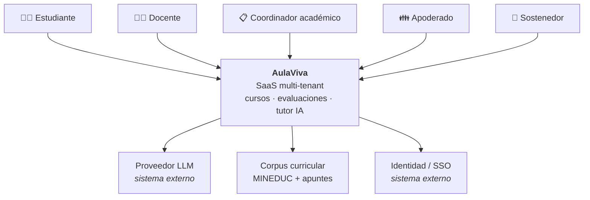

# FeathersForAll — Equipo XX

> Plataforma SaaS multi-tenant con tutor IA para colegios de la Región Metropolitana.
> Proyecto del **Taller de Ingeniería de Software** · 18 sesiones · Semestre 2026.

[](docs/adr/0001-eleccion-iniciativa.md)
[](docs/adr/0001-eleccion-iniciativa.md)
[](CHARTER.md)

---

## Qué es esto

Un grupo de colegios necesita modernizar su experiencia de aprendizaje. AulaViva entrega a docentes y estudiantes una plataforma multi-tenant con gestión de cursos, evaluaciones auto-corregidas y un **tutor IA anclado al currículum vigente del MINEDUC** mediante RAG sobre los apuntes de cada curso.

**Alcance mínimo comprometido (MVP):**

1. Multi-tenancy real — 1 colegio = 1 tenant aislado lógicamente.
2. Gestión de cursos, docentes y estudiantes con RBAC.
3. Evaluaciones auto-corregidas con retroalimentación.
4. Tutor IA con RAG sobre los apuntes de cada curso.
5. Panel del apoderado con seguimiento de avance.

**Restricciones de ingeniería que nos definen:** aislamiento entre tenants, tratamiento de datos de menores, escalabilidad horizontal ante picos en periodo de pruebas, y control de costo del LLM por tenant.

---

## Contexto del sistema (borrador)

Boceto preliminar de actores y límites. Se formaliza como modelo **C4** en la S03.



---

## Equipo

| Integrante | Rol | Área |
|---|---|---|
| Juan | Product Owner | Backlog y valor |
| Iván | Tech Lead | Arquitectura y ADRs |
| Ignacio | DevSecOps Lead | CI/CD, seguridad, observabilidad |
| Bastián | AI/Data Lead | RAG, datos y métricas del modelo |
| Cristofer | QA Lead | Estrategia de pruebas |
| Alex | QA — Automatización | Suite automatizada y quality gates |

Roles, reglas de trabajo, Definition of Done y política de IA: **[CHARTER.md](CHARTER.md)**.

---

## Estructura del repositorio

```text
.
├── CHARTER.md                  # Acta del equipo: roles, DoD, política de IA
├── README.md
├── docs/
│   ├── adr/                    # Architecture Decision Records
│   │   ├── template.md
│   │   └── 0001-eleccion-iniciativa.md
│   └── compromisos-s02.md      # Compromisos hasta la próxima sesión
├── .github/
│   ├── ISSUE_TEMPLATE/
│   └── pull_request_template.md
└── scripts/
    └── bootstrap-board.sh      # Crea labels e issues iniciales vía gh CLI
```

---

## Decisiones arquitectónicas (ADR)

Toda decisión cara de revertir se registra como ADR con el formato **Título · Contexto · Decisión · Consecuencias · Fecha · Autores**.

| ADR | Título | Estado | Fecha |
|---|---|---|---|
| [0001](docs/adr/0001-eleccion-iniciativa.md) | Elección de la iniciativa del semestre: AulaViva | Aceptada | `<DD-MM-2026>` |
| 0002 | Modelo de aislamiento multi-tenant | Pendiente | S03 |

Para crear una nueva: copiar `docs/adr/template.md` con el número correlativo y enlazarla en esta tabla.

---

## Cómo contribuir

1. Toma una issue del board y muévela a `In Progress`.
2. Crea la rama desde `develop`: `feat/<n°issue>-descripcion-corta`.
3. Commits en formato [Conventional Commits](https://www.conventionalcommits.org).
4. Si usaste IA, decláralo con el trailer `AI-Assisted:` en el commit y completa la sección correspondiente del PR.
5. Abre el PR contra `develop` con `Closes #NN`. Requiere 1 aprobación y CI en verde.
6. Verifica el [Definition of Done](CHARTER.md#4-definition-of-done-preliminar) antes de mover la issue a `Done`.

> Las ramas `main` y `develop` están protegidas: sin push directo.

---

## Board Kanban

Seis columnas con criterios de entrada explícitos:

| Columna | Entra cuando… | Límite WIP |
|---|---|---|
| **Backlog** | La idea existe y tiene valor declarado | — |
| **Ready** | Tiene criterios de aceptación, estimación y responsable | 10 |
| **In Progress** | Alguien está trabajando activamente en ella | 1 por persona |
| **In Review** | Hay PR abierto esperando revisión | 4 |
| **QA** | El PR está aprobado y QA valida los criterios de aceptación | 4 |
| **Done** | Cumple el Definition of Done completo | — |

---

## Política de uso de IA

Permitida y esperada, **siempre declarada**. Prohibido subir datos personales reales a cualquier servicio de IA: el proyecto trata datos de menores de edad y trabajamos exclusivamente con datos sintéticos. Detalle completo en el [Charter, sección 5](CHARTER.md#5-política-de-uso-de-ia).

---

## Licencia

Proyecto académico. Uso restringido al Taller de Ingeniería de Software.
