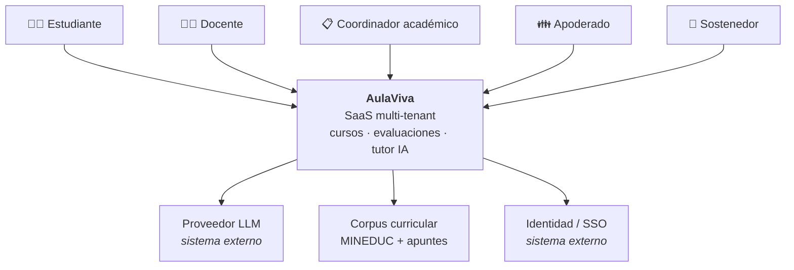

# FeathersForAll — Equipo AulaViva

> Plataforma SaaS multi-tenant con tutor IA para colegios de la Región Metropolitana.
> Proyecto del **Taller de Ingeniería de Software** · 18 sesiones · Semestre 2026.

[](FeathersForAll/Documentos/adr/0001-eleccion-iniciativa.md)
[](FeathersForAll/Documentos/adr/0001-eleccion-iniciativa.md)
[](FeathersForAll/Documentos/Entregables/Charter.md)

---

## Qué es esto

Un grupo de colegios necesita modernizar su experiencia de aprendizaje. AulaViva entrega a docentes y estudiantes una plataforma multi-tenant con gestión de cursos, evaluaciones auto-corregidas y un **tutor IA anclado al currículum vigente del MINEDUC** mediante RAG sobre los apuntes de cada curso.

**Alcance mínimo comprometido (MVP):**

1. Multi-tenancy real — 1 colegio = 1 tenant aislado lógicamente.
2. Gestión de cursos, docentes y estudiantes con RBAC.
3. Evaluaciones auto-corregidas con retroalimentación.
4. Tutor IA con RAG sobre los apuntes de cada curso.
5. Panel del apoderado con seguimiento de avance.

**Restricciones de ingeniería que nos definen:** aislamiento entre tenants, tratamiento de datos de menores, escalabilidad horizontal ante picos en periodo de pruebas, y control de costo del LLM por tenant.

---

## Contexto del sistema (borrador)

Boceto preliminar de actores y límites. Se formaliza como modelo **C4** en la S03.


```mermaid
graph TB
    E["👩‍🎓 Estudiante"] --> AV
    D["👨‍🏫 Docente"] --> AV
    C["📋 Coordinador académico"] --> AV
    A["👪 Apoderado"] --> AV
    S["🏫 Sostenedor"] --> AV

    AV["<b>AulaViva</b><br/>SaaS multi-tenant<br/>cursos · evaluaciones · tutor IA"]

    AV --> LLM["Proveedor LLM<br/><i>sistema externo</i>"]
    AV --> CUR["Corpus curricular<br/>MINEDUC + apuntes"]
    AV --> ID["Identidad / SSO<br/><i>sistema externo</i>"]
```

---

## Equipo

| Integrante | Rol | Área |
|---|---|---|
| Juan | Product Owner | Backlog y valor |
| Iván | Tech Lead | Arquitectura y ADRs |
| Ignacio | DevSecOps Lead | CI/CD, seguridad, observabilidad |
| Bastián | AI/Data Lead | RAG, datos y métricas del modelo |
| Cristofer | QA Lead | Estrategia de pruebas |
| Alex | QA — Automatización | Suite automatizada y quality gates |

Roles, reglas de trabajo, Definition of Done y política de IA: **[CHARTER.md](FeathersForAll/Documentos/Entregables/Charter.md)**.

---

## Estructura del repositorio

```text
.
├── readme.md
└── FeathersForAll/
    └── Documentos/
        ├── Entregables/
        │   └── Charter.md              # Acta del equipo: roles, DoD, política de IA
        ├── adr/                        # Architecture Decision Records
        │   ├── template.md
        │   ├── 0001-eleccion-iniciativa.md
        │   └── 0002-estilo-arquitectonico.md
        ├── arch/
        │   └── atributos-calidad.md    # Top 3 NFRs con métricas
        ├── c4/                         # l1-context y l2-container (.puml + .png)
        ├── scenarios/                  # 15 escenarios Gherkin (h1..h5 .feature)
        ├── cloud/
        │   └── managed-services.md      # Servicios gestionados y trazabilidad
        ├── 12-factor-checklist.md      # Auditoría 12-Factor (S04)
        ├── impact-map.md
        └── backlog.md                  # 5 historias INVEST + MoSCoW
```

Pendiente según el taller: `api/openapi.yaml` (S05); `data/` y `adr/0004` (S06).

---

## Decisiones arquitectónicas (ADR)

Toda decisión cara de revertir se registra como ADR con el formato **Título · Contexto · Decisión · Consecuencias · Fecha · Autores**.

| ADR | Título | Estado | Fecha |
|---|---|---|---|
| [0001](FeathersForAll/Documentos/adr/0001-eleccion-iniciativa.md) | Elección de la iniciativa del semestre: AulaViva | Aceptada | 21-08-2026 |
| [0002](FeathersForAll/Documentos/adr/0002-estilo-arquitectonico.md) | Estilo arquitectónico: modular monolith (incluye aislamiento multi-tenant con RLS, Tutor IA como contenedor con módulo aislado y worker con cola) | Aceptada (por ratificar en reunión) | 28-09-2026 |
| [0003](FeathersForAll/Documentos/adr/0003-cloud.md) | Decisión cloud: arquitectura híbrida Vercel + Render + AWS | Aceptada (por ratificar en reunión) | 28-09-2026 |
| 0004 | Datos y eventos | Pendiente | S06 |

Para crear una nueva: copiar `FeathersForAll/Documentos/adr/template.md` con el número correlativo y enlazarla en esta tabla.

---

## Cómo contribuir

1. Toma una issue del board y muévela a `In Progress`.
2. Crea la rama desde `develop`: `feat/<n°issue>-descripcion-corta`.
3. Commits en formato [Conventional Commits](https://www.conventionalcommits.org).
4. Si usaste IA, decláralo con el trailer `AI-Assisted:` en el commit y completa la sección correspondiente del PR.
5. Abre el PR contra `develop` con `Closes #NN`. Requiere 1 aprobación y CI en verde.
6. Verifica el [Definition of Done](FeathersForAll/Documentos/Entregables/Charter.md#7-definition-of-done-dod) antes de mover la issue a `Done`.

> Las ramas `main` y `develop` están protegidas: sin push directo.

---

## Board Kanban

Seis columnas con criterios de entrada explícitos:

| Columna | Entra cuando… | Límite WIP |
|---|---|---|
| **Backlog** | La idea existe y tiene valor declarado | — |
| **Ready** | Tiene criterios de aceptación, estimación y responsable | 10 |
| **In Progress** | Alguien está trabajando activamente en ella | 1 por persona |
| **In Review** | Hay PR abierto esperando revisión | 4 |
| **QA** | El PR está aprobado y QA valida los criterios de aceptación | 4 |
| **Done** | Cumple el Definition of Done completo | — |

---

## Política de uso de IA

Permitida y esperada, **siempre declarada**. Prohibido subir datos personales reales a cualquier servicio de IA: el proyecto trata datos de menores de edad y trabajamos exclusivamente con datos sintéticos. Detalle completo en el [Charter, sección 8](FeathersForAll/Documentos/Entregables/Charter.md#8-política-de-uso-de-inteligencia-artificial).

---

## Licencia

Proyecto académico. Uso restringido al Taller de Ingeniería de Software.
